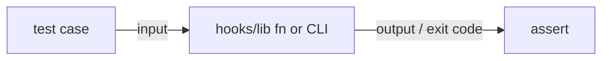
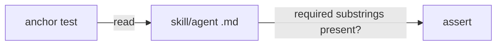
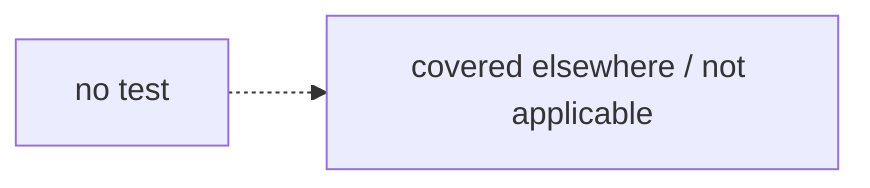

# Testing

How this plugin is tested. Zero-dependency Node runner (`tests/run.cjs`); each `tests/*.test.cjs` exports an array of `{name, fn}` where `fn` throws on failure. Run with `node tests/run.cjs`.

## Test Types

The plugin's sanctioned test types. This is a tooling/library repo, so unit tests of pure `hooks/lib` functions are the DEFAULT type (not an exception) — there is no HTTP boundary here.

### lib-unit
- **boundary:** a `hooks/lib/*.js` public function or its CLI
- **pattern:** `node:assert` against the required module, via `tests/run.cjs`
- **location:** `tests/*.test.cjs`
- **tier:** default
- **when-to-use:** testing a deterministic `hooks/lib` function (parser, gate, engine) — input → output, no model calls
- **primitives:** `require('../hooks/lib/…')`, `assert`, `spawnSync` for the CLI shim
- **match-paths:** tests/*.test.cjs
- **match-markers:** require, assert

### prompt-anchor
- **boundary:** the prose/wiring of a skill or agent markdown file
- **pattern:** read the file, assert required substrings (and forbidden ones) survive future edits
- **location:** `tests/*.test.cjs`
- **tier:** exception
- **when-to-use:** locking a skill/agent's wiring so a future edit can't silently drop it (e.g. a skill must still invoke a gate)
- **primitives:** `fs.readFileSync`, `String.includes`
- **match-paths:** tests/*.test.cjs
- **match-markers:** readFileSync, SKILL.md

### none
- **boundary:** —
- **pattern:** —
- **location:** —
- **tier:** sign-off
- **when-to-use:** a task that ships no test and is not test-covered — docs, version bumps, pure refactors, data files validated elsewhere
- **primitives:** n/a

