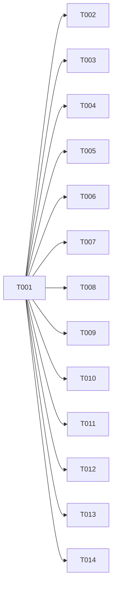

# Implementation Plan: Language-Agnostic Core

## Context

De-couple the plugin from its residual language privilege. The workflow, taxonomy, craft
rubric, `/test-audit`, and `/verify` (runs the repo's own command) are already
language-agnostic in mechanism. The privilege that remains lives in `agents/executor.md`
(hardcodes `go.mod`/`tsconfig` detection and points at a non-existent bare `tdd` skill) and
in the docs' "Go is the supported stack" framing. This feature removes that, fixes the
dangling reference everywhere it appears, confirms `/verify` + `/init` are stack-neutral,
and rewords docs to the agnostic model. It adds **no** per-language file (FR-008/SC-004) and
keeps `tdd-go`/`go-verified-development` as-is so Go is not regressed (AS-002/FR-009).

Spec: `.verified/features/language-agnostic-core/spec.md` (8 scenarios, 9 requirements,
6 edge cases, 6 success criteria).

The bare `tdd` skill reference (no such skill exists; the neutral skill is `testing`) appears
in seven occurrences across five files: `agents/executor.md:27`, `skills/react-testing/SKILL.md:9`
& `:589`, `skills/front-end-testing/SKILL.md:9` & `:1060`, `skills/implement/SKILL.md:64`,
`skills/quick/SKILL.md:39`. All repoint to `testing`. (T001's repo-wide scan (a) is the
authority — it found `quick/SKILL.md`, which the first plan draft missed; T014 added in
implement to cover it.)

## Tasks

### Phase 1: Guard + anchor tests (RED)
- [x] T001 Write the RED guard + anchor test file (files: tests/language-agnostic-core.test.cjs) (test: prompt-anchor) (scenario: AS-001, AS-002, AS-003, AS-004, AS-005, AS-006, AS-007). Zero-dep, `module.exports = [{name, fn}, …]` — **one named entry per assertion group below**, matching the `tests/test-audit.test.cjs` style for per-assertion failure attribution during the parallel Wave 2; tolerant `read()` returning '' on ENOENT. Each entry asserts:
  - **(a) SC-003 dangling-ref scan** [RED] — no occurrence of the backtick-exact skill reference `` `tdd` `` in any file under `agents/` or `skills/` (regex on the literal backtick-`tdd`-backtick token; `tdd-go`, `tdd-cycle`, prose "TDD" must NOT trip it).
  - **(b) SC-004 no-new-per-language-files** [regression guard — green now, must stay green] — `skills/` contains no `tdd-<lang>` directory except `tdd-go`; `docs/` contains no `*-stack.md` except `go-stack.md`.
  - **(c) AS-001 executor neutral** [RED] — `agents/executor.md` contains "load the `testing` skill" and "infer" and "`.verified/codebase/`", and does NOT contain the two-branch detection strings "Go projects (`go.mod`)" / "TypeScript projects (`tsconfig.json`)".
  - **(d) AS-002 Go kept** [regression guard — green now, must stay green] — `agents/executor.md` still names `tdd-go` for Go.
  - **(e) AS-003 referenced skills exist** [RED — fails until the bare `tdd` refs are repointed] — every `` `<name>` `` skill reference in `agents/executor.md`, `skills/react-testing/SKILL.md`, `skills/front-end-testing/SKILL.md`, `skills/implement/SKILL.md` resolves to a directory under `skills/`.
  - **(f) AS-001 implement neutral** [RED] — `skills/implement/SKILL.md` does NOT contain "TypeScript projects (tsconfig.json): load `tdd`" and DOES contain "infer" (guards T005's half of AS-001, parallel to (c)).
  - **(g) AS-004 verify neutral** [RED] — `skills/verify/SKILL.md` contains "language-agnostic" (or "regardless of language"), states the detection priority (config.json custom command first, covering EC-005 multi-manifest), and its no-command branch tells the user to "run `/init`" (EC-001) rather than implying failure.
  - **(h) AS-005 init neutral** [RED] — `skills/init-project/SKILL.md` does NOT contain "Supported stacks: **Go**" and DOES contain neutral framing ("any language" / "does not assume").
  - **(i) AS-002 init keeps Go** [regression guard] — `skills/init-project/SKILL.md` still describes the Go toolchain scaffold (relabeled as an example), proving the Go capability was relabeled not removed.
  - **(j) AS-006 docs** [RED] — `README.md` contains "language-agnostic" and no longer contains "wired for Go today"; `docs/go-stack.md` contains "one example".
  - **(k) AS-007 extension point** [RED] — `docs/configuration.md` contains "Teaching the plugin your stack" and "`.verified/codebase/`"; `CLAUDE.md` contains "Language-agnostic core".
  - **(l) ADR present** [RED] — a file matching `.verified/decisions/0002-*.md` exists and contains "infer".

### Phase 2: De-privilege the executor (AS-001/AS-002/AS-003)
- [x] T002 Rewrite the `## Setup` section of `agents/executor.md` (lines 24-28): drop the two-language `go.mod`/`tsconfig` branch and the bare `` `tdd` `` reference. New text: always load the neutral `testing` skill, then resolve the repo's test runner and idioms via an explicit **priority ladder** so the result is reproducible across executors: (1) `.verified/codebase/TESTING.md` is authoritative when present (its `## Test Types` and patterns win); (2) else infer the dominant framework/assertion style from the repo's existing test files; (3) else (no docs, no existing tests — EC-002, e.g. Rust/Elixir) fall back to the neutral `testing` skill with no idiom assumptions and proceed (never a missing-skill error). For Go repos (`go.mod`) additionally apply `tdd-go` as the one bundled language example. Phrase the Go case and the inference model **identically to `skills/implement/SKILL.md`** (T005) — both files describe the same mechanic. Update the `## Rules` "Follow the project's existing test patterns" line to point at the inferred idioms. (files: agents/executor.md) (depends on T001) (test: prompt-anchor) (scenario: AS-001, AS-002, AS-003)

### Phase 3: Fix remaining dangling `tdd` references (AS-003)
- [x] T003 [P] `skills/react-testing/SKILL.md`: line 9 "For TDD workflow, load the `tdd` skill." → "load the `testing` skill."; line 589 checklist "(see `tdd` skill)" → "(see `testing` skill)". (files: skills/react-testing/SKILL.md) (depends on T001) (test: prompt-anchor) (scenario: AS-003)
- [x] T004 [P] `skills/front-end-testing/SKILL.md`: line 9 "For TDD workflow, load the `tdd` skill." → "load the `testing` skill."; line 1060 checklist "(see `tdd` skill)" → "(see `testing` skill)". (files: skills/front-end-testing/SKILL.md) (depends on T001) (test: prompt-anchor) (scenario: AS-003)
- [x] T014 [P] `skills/quick/SKILL.md` line 39: replace "Load the appropriate TDD skill (`tdd-go` for Go, `tdd` for TypeScript)." with the neutral rule — load the `testing` skill and resolve idioms via the priority ladder (TESTING.md → existing tests → neutral fallback); `tdd-go` for Go repos as the bundled example. Phrasing consistent with T002/T005. (files: skills/quick/SKILL.md) (depends on T001) (test: prompt-anchor) (scenario: AS-001, AS-003)
- [x] T005 [P] `skills/implement/SKILL.md` step 4 language-detection block (lines ~62-64): neutralize the whole block, not just line 64. Replace the binary "Detect the project language and load the appropriate TDD skill: Go / TypeScript" framing and the bare `` `tdd` `` reference with the same neutral rule as T002: load the `testing` skill and resolve idioms via the priority ladder (TESTING.md → existing tests → neutral fallback); keep one Go line ("Go projects (go.mod): load `tdd-go` skill") as the bundled example. Use phrasing for the Go case and the inference model **identical to `agents/executor.md`** (T002) so the two files don't drift. (files: skills/implement/SKILL.md) (depends on T001) (test: prompt-anchor) (scenario: AS-001, AS-003)

### Phase 4: Confirm /verify and /init are stack-neutral (AS-004/AS-005)
- [x] T006 [P] `skills/verify/SKILL.md`: in step 1 add one sentence stating detection is **language-agnostic** — it runs whatever the repo declares, in priority order: `config.json` custom command first, else `Justfile`/`Makefile`/`package.json`/`pom.xml` target (this priority covers EC-005: a repo with multiple manifests resolves via `config.json` and never silently defaults to Go). For the "none found" branch (EC-001) reword to clear guidance — "run `/init` to define a verify command" — rather than implying failure. No Go-specific assumption introduced. (files: skills/verify/SKILL.md) (depends on T001) (test: prompt-anchor) (scenario: AS-004)
- [x] T007 [P] `skills/init-project/SKILL.md`: reframe so the neutral path is the default — step 1 detects language without privileging one; the primary scaffold is `.verified/` + capturing/prompting for the repo's verify command, and it **does not assume a stack**. The Go toolchain scaffold (Justfile/golangci) is **kept** but changes from automatic-for-Go to an explicitly-offered, clearly-labeled **example** for Go (line 20 "Supported stacks: **Go**…" reworded; step 6 "Scaffold Language-Specific Configs" reframed as "offer the bundled Go example when the repo is Go"). Per FR-009/AS-002 the Go scaffold capability is retained; only its automatic/privileged status is removed. (files: skills/init-project/SKILL.md) (depends on T001) (test: prompt-anchor) (scenario: AS-005)

### Phase 5: Reword docs to the agnostic model (AS-006/AS-007)
- [x] T008 [P] `README.md` line 3: replace the "Language-aware… wired for Go today, with the other stacks landing" sentence with the agnostic statement — the plugin is language-agnostic: it runs the repo's own verify command and infers test idioms; the bundled Go toolchain and `/test-audit` adapters (Go/TS/Python/Java) are examples, and per-repo mechanics live in `.verified/codebase/` or a repo skill. Update the docs-table `Go stack` row description to read as one example. (files: README.md) (depends on T001) (test: prompt-anchor) (scenario: AS-006)
- [x] T009 [P] `docs/go-stack.md`: line 1-3 add an intro framing Go as **one example** of wiring a stack's verify command (the plugin is language-agnostic — it runs the repo's own command); reword "Go is the first fully-supported stack" and the "Future stacks" matrix so Go reads as an example, not "the supported stack". Do NOT restate the per-repo extension-point model here — that lives solely in T010 (`docs/configuration.md`); link to it instead (avoids duplicate/divergent prose between the two concurrent doc tasks). (files: docs/go-stack.md) (depends on T001) (test: prompt-anchor) (scenario: AS-006)
- [x] T010 [P] `docs/configuration.md`: add a "## Teaching the plugin your stack" section — the plugin does not bundle per-language toolchains; teach a repo's test mechanics/idioms and verify command via `.verified/codebase/` docs (written by `/map`) or a per-repo skill; the executor infers from these. (files: docs/configuration.md) (depends on T001) (test: prompt-anchor) (scenario: AS-007)

### Phase 6: Project docs + version
- [x] T011 [P] `CLAUDE.md`: add a "### Language-agnostic core (v1.9.0+)" section under "Workflow features" — the executor loads neutral `testing` + infers idioms (no hardcoded language list), the bare `tdd` reference is gone (drift-guarded by `tests/language-agnostic-core.test.cjs`), the no-new-per-language-file invariant (SC-004), and the per-repo extension point. (files: CLAUDE.md) (depends on T001) (test: prompt-anchor) (scenario: AS-007)
- [x] T012 [P] Bump version `1.8.0` → `1.9.0` in `.claude-plugin/plugin.json` and `.claude-plugin/marketplace.json` (both to the literal `"1.9.0"`, kept in sync). Config change, no TDD. (files: .claude-plugin/plugin.json, .claude-plugin/marketplace.json) (depends on T001) (test: none) (scenario: AS-008)
- [x] T013 [P] Write `.verified/decisions/0002-language-agnostic-executor.md` (ADR, format mirrors `0001-test-taxonomy-design.md`): decision — replace the executor's explicit `go.mod`/`tsconfig` branching with "load neutral `testing` + inference priority ladder"; rationale — toolchains are depreciating assets, the workflow is the durable value; rejected alternatives — (i) extend the explicit branch list to N languages, (ii) require a per-repo skill to unlock any language; consequences — executor idiom-resolution is now inference-driven (made reproducible by the priority ladder), Go retained as the one bundled example, no per-language files added (SC-004). Clears the standing ADR debt the critics flagged. (files: .verified/decisions/0002-language-agnostic-executor.md) (depends on T001) (test: prompt-anchor) (scenario: AS-001)

## Task Legend
- `(files: …)` = file surface (wave-engine collision input).
- `(depends on TXXX)` = ordering.
- `(test: …)` = sanctioned test type from `.verified/codebase/TESTING.md` (`prompt-anchor` = exception tier; `none` = sign-off tier).
- `(scenario: …)` = acceptance-scenario ids served.
- `[P]` = human parallelism hint; the wave engine is authoritative.

## Waves

Computed by `hooks/lib/waves.js` (exit 0, no collisions, `parallel: true`). Do not hand-edit.

| Wave | Tasks | Runs |
|------|-------|------|
| 1 | T001 | RED test file (sole) |
| 2 | T002, T003, T004, T005, T006, T007, T008, T009, T010, T011, T012, T013, T014 | concurrent — every task touches a disjoint file surface |

## Test Boundaries

Computed by `hooks/lib/test-gate.js check` (against `.verified/codebase/TESTING.md`).

| Task | test type | tier | scenarios |
|------|-----------|------|-----------|
| T001 | prompt-anchor | exception | AS-001, AS-002, AS-003, AS-004, AS-005, AS-006, AS-007 |
| T002 | prompt-anchor | exception | AS-001, AS-002, AS-003 |
| T003 | prompt-anchor | exception | AS-003 |
| T004 | prompt-anchor | exception | AS-003 |
| T005 | prompt-anchor | exception | AS-001, AS-003 |
| T006 | prompt-anchor | exception | AS-004 |
| T007 | prompt-anchor | exception | AS-005 |
| T008 | prompt-anchor | exception | AS-006 |
| T009 | prompt-anchor | exception | AS-006 |
| T010 | prompt-anchor | exception | AS-007 |
| T011 | prompt-anchor | exception | AS-007 |
| T012 | none | **sign-off** | AS-008 |
| T013 | prompt-anchor | exception | AS-001 |
| T014 | prompt-anchor | exception | AS-001, AS-003 |

**Gate:** `SIGNOFF_REQUIRED` on T012 (version bump ships no test). To be approved at `/implement` and persisted in `test-signoffs.json`. All 8 acceptance scenarios (AS-001…AS-008) are served by T001's assertions + impl tasks; no dangling/unserved scenarios.

## Verification
- `node tests/run.cjs` — all pre-existing tests (206) plus the new `language-agnostic-core` tests green (SC-002/SC-005, AS-008).
- `node scripts/lint-descriptions.cjs` — descriptions within budget.
- `node hooks/lib/waves.js compute .verified/features/language-agnostic-core/plan.md` — exit 0, no collisions.
- `node hooks/lib/test-gate.js` — exit 0 after T012 sign-off (the one `none` task).
- Manual diff check for SC-004: the diff adds zero `*-verified-development`, `tdd-<lang>`, or `docs/<lang>-stack.md` files (also asserted by T001).
- `/review` two-stage review.

## Decisions
- **Core pivot: inference over branching (ADR 0002, T013).** The executor stops hardcoding a language list and resolves idioms via the priority ladder (TESTING.md → existing tests → neutral fallback). Rejected: extending the explicit branch list to N languages (bundles depreciating toolchain knowledge); requiring a per-repo skill to unlock any language (too much friction). This is the architectural heart of the feature — recorded as an ADR, not just inline.
- **`/init` reframed — Go auto-scaffold becomes opt-in (honest restatement).** AS-005 wants `/init` stack-neutral; FR-009/AS-002 forbid regressing Go. Reconciliation: the neutral `.verified/` + verify-command path becomes the default, and the Go config scaffold changes from *automatic for Go repos* to *explicitly offered/labeled example*. The Go capability is **retained**; its **automatic, privileged status is removed**. (Earlier draft wrongly said "no Go capability is removed" with no qualifier — corrected per strategic critic.)
- **EC-006 honored.** Only the backtick-exact bare `` `tdd` `` skill reference is the bug. `tdd-go` (a real skill) and prose "TDD"/"tdd-cycle" are left untouched; the T001 scan matches only the literal `` `tdd` `` token.
- **One `none` task.** Only T012 (version bump) ships no test → `none`/sign-off tier; everything else is `prompt-anchor` (exception, no friction). T013 (ADR) is prompt-anchored by T001(l) rather than `none`, so no extra sign-off. Sign-off for T012 requested at implement time.
