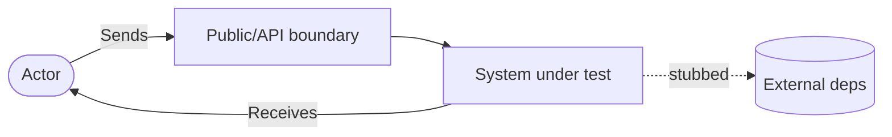
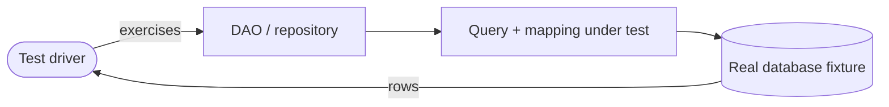
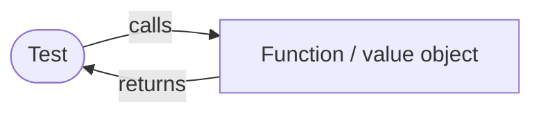
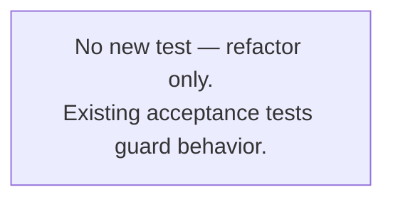

<!--
  hooks/lib/test-types-seed.md — the shipped SEED test taxonomy.

  Single source of truth with two roles: (1) parsed by `taxonomy.js` as the
  fallback when a repo defines no `## Test Types` section; (2) copied/adapted
  into a repo's `.verified/codebase/TESTING.md` by `/map` and `/init`. Keep the
  field syntax below stable — the parser keys on `- **<field>:** <value>` lines
  and a fenced ```mermaid block per `### <type>` subsection.

  `anti-patterns:` IS A GATE. test-review criterion 5b raises a violation of a
  type's declared anti-pattern as an `error` that blocks review — the repo made
  the call, so the reviewer matches a declaration against code rather than
  exercising taste. So this field must hold MECHANICAL, no-judgment smells only.
  Adapt the wording per repo; do not quietly drop the boundary entries.

  BOUNDARY DOCTRINE (the entries below encode it; adapt, don't delete):

    Work at YOUR test's declared boundary — never below it, to arrange OR to
    assert. "Below" is measured against the boundary of the test's OWN type, not
    the layer the production code happens to live in. An API-boundary test that
    calls a repository method to seed a precondition or read a result back is
    violating it just as much as a DAO test that drops to raw SQL.

    Prefer re-reading THROUGH the boundary. A re-read proves what durably
    persisted; a read taken next to the write only proves what was written. And
    prefer driving a production endpoint to seed state — a direct store write can
    manufacture a state the system could never actually reach.

    If the boundary cannot express what you need, EXTEND IT (add an observation /
    a named Given helper to the harness). Reaching around it because it is quicker
    is the violation, not the workaround.

    Genuinely un-exposable state (an internal audit table; an append-only
    invariant that is *about* what lives below the API) is a real exception — but
    declare it ONCE as a named harness observation with its justification, rather
    than scattering raw store access through test bodies. If you need a third such
    exception, you probably need an observation instead.

  ORACLE PROVENANCE — deliberately NOT listed as an anti-pattern below.
  test-review criterion 9 surfaces circular oracles (expected values recorded from
  the code's own current output: snapshots, golden files, or calling the
  production compute to work out what the answer "should" be) as a NON-blocking
  warning. That is the right default: a repo built on approval testing would
  otherwise be unable to land a single test. A repo that wants them to BLOCK may
  add "circular oracles" to its own `anti-patterns:` — an escalation the repo
  opts into, not one the seed imposes.
-->

## Test Types

### acceptance
- **boundary:** public/API
- **pattern:** actor-based Sends/Receives DSL
- **location:** tests at the public boundary (e.g. `*/acceptance`, `tests/acceptance`)
- **tier:** default
- **when-to-use:** Default for any task that adds user-observable behavior. Drive the system through its public boundary as an external actor; assert on what the actor receives, never on internals.
- **primitives:** Sends, Receives, EventuallyReceives, actor/world fixtures
- **match-paths:** **/acceptance/**, **/scenarios/**, **/*_acceptance_test.go
- **match-markers:** Sends, Receives, EventuallyReceives
- **good-example:** tests/acceptance/checkout_test.go::TestCustomerChecksOut
- **bad-example:** tests/acceptance/checkout_test.go::TestCheckoutInternals (asserts on internal state)
- **anti-patterns:** scattered raw assertions, inline ids instead of captured data, SendsAndAwaits + require, multiple behaviors per test, reading state back below the boundary (a repository/DAO/SQL read) instead of re-reading through the boundary, seeding state below the boundary when the system's own API can drive it, mutating a fixture after construction instead of deriving a new one



### dao
- **boundary:** database
- **pattern:** real DB fixture
- **location:** data-access tests next to the repository/DAO (e.g. `*/dao`, `*/store`)
- **tier:** exception
- **when-to-use:** Sanctioned when behavior cannot be observed through the public boundary and needs a real datastore (query shape, migrations, persistence semantics). Used without per-task sign-off, but prefer acceptance where possible.
- **primitives:** real DB fixture, transactional setup/teardown, seed helpers
- **match-paths:** **/dao/**, **/store/**, **/*_dao_test.go, **/*_store_test.go
- **match-markers:** testdb, sqlx, BeginTx, migrate
- **good-example:** internal/store/orders_dao_test.go::TestOrderRoundTrips
- **bad-example:** internal/store/orders_dao_test.go::TestOrderService (exercises service logic, not persistence)
- **anti-patterns:** mocking the database, asserting through the service layer, shared mutable fixture across tests, no teardown, raw-SQL read-back instead of reading through the DAO under test



### unit
- **boundary:** near the code
- **pattern:** standard test
- **location:** unit tests beside the unit under test (e.g. `*_test` next to source)
- **tier:** sign-off
- **when-to-use:** Reserved for genuinely complex pure logic (algorithms, value objects, parsers) where a behavioral test would be indirect. Requires per-task sign-off so it is a deliberate exception, not the default.
- **primitives:** standard test runner, table-driven cases
- **match-paths:** **/*_test.go
- **match-markers:** assert, require, t.Run
- **good-example:** internal/pricing/discount_test.go::TestDiscountRounding
- **bad-example:** internal/pricing/discount_test.go::TestHandlerWiring (tests glue, not complex logic)
- **anti-patterns:** unit-testing trivial glue, mocking everything, testing implementation details, one assertion per method getter/setter



### none
- **boundary:** —
- **pattern:** —
- **location:** —
- **tier:** sign-off
- **when-to-use:** For tasks that change structure without adding behavior (refactor, rename, move). Exempt from the scenario-reference requirement but sign-off tier so the "no new test" choice is explicit and human-reviewed.
- **primitives:** n/a
- **match-paths:** —
- **match-markers:** —
- **good-example:** n/a
- **bad-example:** n/a
- **anti-patterns:** —


