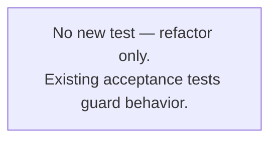

<!--
  hooks/lib/test-types-seed.md — the shipped SEED test taxonomy.

  Single source of truth with two roles: (1) parsed by `taxonomy.js` as the
  fallback when a repo defines no `## Test Types` section; (2) copied/adapted
  into a repo's `.verified/codebase/TESTING.md` by `/map` and `/init`. Keep the
  field syntax below stable — the parser keys on `- **<field>:** <value>` lines
  and a fenced ```mermaid block per `### <type>` subsection.
-->

## Test Types

### acceptance
- **boundary:** public/API
- **pattern:** actor-based Sends/Receives DSL
- **location:** tests at the public boundary (e.g. `*/acceptance`, `tests/acceptance`)
- **tier:** default
- **when-to-use:** Default for any task that adds user-observable behavior. Drive the system through its public boundary as an external actor; assert on what the actor receives, never on internals.
- **primitives:** Sends, Receives, EventuallyReceives, actor/world fixtures
- **match-paths:** **/acceptance/**, **/scenarios/**, **/*_acceptance_test.go
- **match-markers:** Sends, Receives, EventuallyReceives
- **good-example:** tests/acceptance/checkout_test.go::TestCustomerChecksOut
- **bad-example:** tests/acceptance/checkout_test.go::TestCheckoutInternals (asserts on internal state)
- **anti-patterns:** scattered raw assertions, inline ids instead of captured data, SendsAndAwaits + require, multiple behaviors per test


### dao
- **boundary:** database
- **pattern:** real DB fixture
- **location:** data-access tests next to the repository/DAO (e.g. `*/dao`, `*/store`)
- **tier:** exception
- **when-to-use:** Sanctioned when behavior cannot be observed through the public boundary and needs a real datastore (query shape, migrations, persistence semantics). Used without per-task sign-off, but prefer acceptance where possible.
- **primitives:** real DB fixture, transactional setup/teardown, seed helpers
- **match-paths:** **/dao/**, **/store/**, **/*_dao_test.go, **/*_store_test.go
- **match-markers:** testdb, sqlx, BeginTx, migrate
- **good-example:** internal/store/orders_dao_test.go::TestOrderRoundTrips
- **bad-example:** internal/store/orders_dao_test.go::TestOrderService (exercises service logic, not persistence)
- **anti-patterns:** mocking the database, asserting through the service layer, shared mutable fixture across tests, no teardown


### unit
- **boundary:** near the code
- **pattern:** standard test
- **location:** unit tests beside the unit under test (e.g. `*_test` next to source)
- **tier:** sign-off
- **when-to-use:** Reserved for genuinely complex pure logic (algorithms, value objects, parsers) where a behavioral test would be indirect. Requires per-task sign-off so it is a deliberate exception, not the default.
- **primitives:** standard test runner, table-driven cases
- **match-paths:** **/*_test.go
- **match-markers:** assert, require, t.Run
- **good-example:** internal/pricing/discount_test.go::TestDiscountRounding
- **bad-example:** internal/pricing/discount_test.go::TestHandlerWiring (tests glue, not complex logic)
- **anti-patterns:** unit-testing trivial glue, mocking everything, testing implementation details, one assertion per method getter/setter


### none
- **boundary:** —
- **pattern:** —
- **location:** —
- **tier:** sign-off
- **when-to-use:** For tasks that change structure without adding behavior (refactor, rename, move). Exempt from the scenario-reference requirement but sign-off tier so the "no new test" choice is explicit and human-reviewed.
- **primitives:** n/a
- **match-paths:** —
- **match-markers:** —
- **good-example:** n/a
- **bad-example:** n/a
- **anti-patterns:** —


